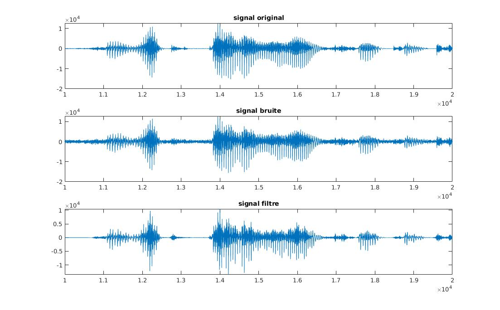
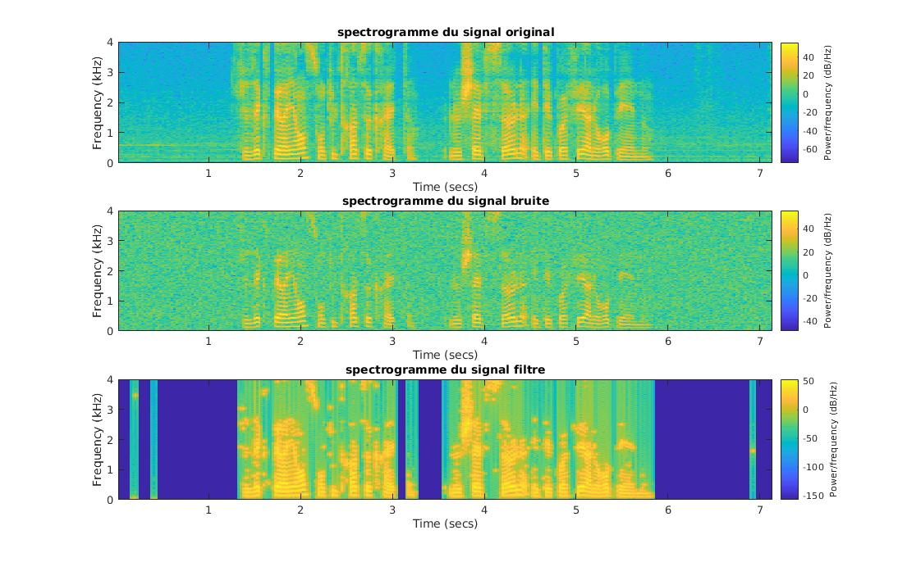
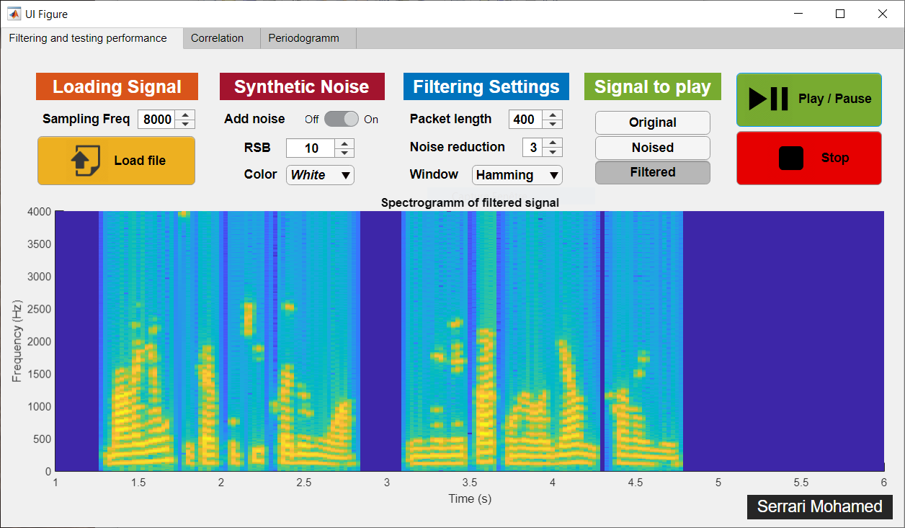

# Voice Enhancer

Rehaussement d'un signal de parole mono-voie par decomposition en valeurs singulières

### Visualisation des signaux en fonction du temps

### Visualisation du spectrogramme des signaux

### Utilisation de l'interface

1. Clonez la répo et lancez `Interface.mlapp`

2. Chargez le fichier `fcno03fz.mat` ou `fcno04fz.mat` en cliquant sur le bouton `Load File`

3. Selectionnez le signal à jouer `Original, Noised, Filtered` et cliquez sur Play

## Resources

https://stats.stackexchange.com/questions/207760/when-is-a-biased-estimator-preferable-to-unbiased-one